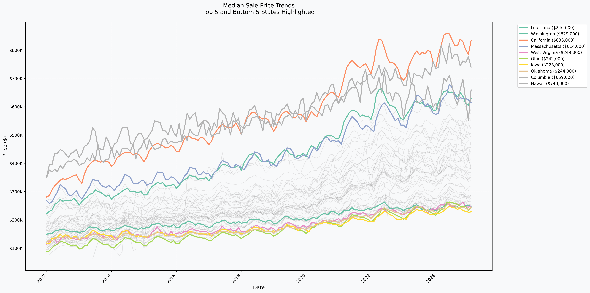
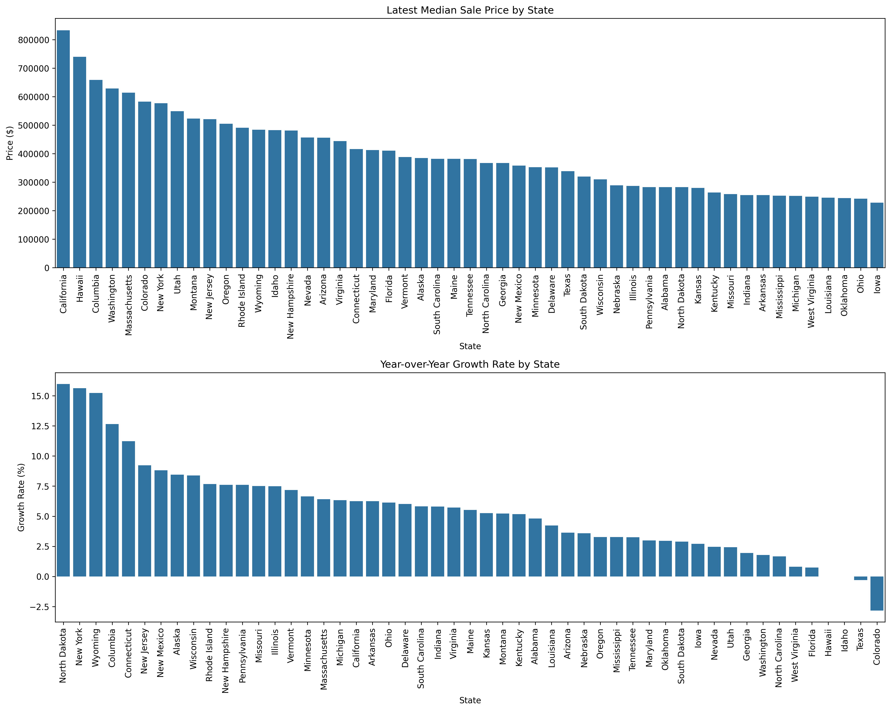

# Data Analyzer

This repo is for a Trial Assesment for Data Analyst position at Clever. This is a Python package for processing and analyzing CSV data files with a rich command-line interface. This tool is designed to process various data sources and generate comprehensive analysis reports.

## Features

- **CSV Processing**: Efficient processing of multiple CSV files using pandas
- **TSV Support**: Built-in support for processing TSV (Tab-Separated Values) files
- **Rich CLI Interface**: Modern command-line interface built with Click
- **Data Analysis**: Comprehensive data processing and analysis capabilities
- **Error Handling**: Robust error handling and logging

## Data Notes

### Hard-coded Values
Some values in the dataset are hard-coded based on the example output spreadsheet, as they are not present in the source data files:

- Washington DC median sale price: $565,000
- Puerto Rico median sale price: $138,000

These values are maintained in the `process_median_sale_price_data` function in `data_analyzer/data_processor.py`.

## Installation

### Prerequisites
- Python 3.8 or higher
- pip (Python package installer)

### Setup Steps

1. **Clone the Repository**
```bash
git clone https://github.com/marwaneltoukhy/clever-assesment.git
cd data-analyzer
```

2. **Create and Activate Virtual Environment**
```bash
# Create virtual environment
python -m venv venv

# Activate virtual environment
# On macOS/Linux:
source venv/bin/activate
# On Windows:
# venv\Scripts\activate
```

3. **Install Dependencies**
```bash
pip install .
```

## Usage

### Command Line Interface

The package provides a rich CLI interface with the following commands:

```bash
# Process data files
data-analyzer process --input-dir data/input --output-dir data/output

# Get help
data-analyzer --help
```

### Command Options

- `--input-dir`: Directory containing input CSV files (default: data/input)
- `--output-dir`: Directory to save output files (default: data/output)

## Project Structure

```
clever-assesment/
├── data_analyzer/              # Main package code
│   ├── __init__.py             # Package initialization
│   ├── cli.py                  # Command-line interface
│   ├── data_processor.py       # Core data processing logic
│   ├── time_series_analyzer.py # time series processing logic
│   ├── logger.py               # Logging utilities
│   └── utils.py                # Utility functions
├── data/                       # Data directories
│   ├── input/                  # Input CSV files
│   └── output/                 # Output files
├── setup.py                    # Package setup configuration
└── pyproject.toml              # Project metadata and dependencies
```

## Visualizations and Extended Analysis

As an extra step in the analysis, I created a timeseries analysis from the data provided by redfin. My analysis show cases the YoY and MoM analysis over the whole dataset, also a visualization of the timeseries analysis. For more information about the timeseries analysis please take a look at the [time series README](data/output/time_series/README.md).

### Median Sale Price Trends


### Price and Growth Summary


## Code Documentation

### CLI Module (`cli.py`)

The command-line interface is built using Click and provides the following functionality:

```bash
Usage: data-analyzer process [OPTIONS]

  Process CSV files and generate analysis.

Options:
  --input-dir DIRECTORY   Directory containing input CSV files (default:
                          data/input)
  --output-dir DIRECTORY  Directory to save output CSV files (default:
                          data/output)
  --help                  Show this message and exit.
```

### Data Processor (`data_processor.py`)

The data processor module handles the core data processing logic:

- CSV file reading and validation
- Data transformation and analysis
- Output generation
- Error handling and logging

Key functions:

#### Core Processing Functions
- `process_csv_files`: Main processing function that orchestrates the entire data processing pipeline
- `read_csv_file`: Reads CSV or TSV files into pandas DataFrames
- `combine_data`: Combines data from Series or DataFrame into an existing DataFrame

#### Data Processing Functions
- `process_keys_data`: Processes region key data
- `process_census_population_data`: Processes census population data
- `process_median_household_income_data`: Processes median household income data
- `process_median_sale_price_data`: Processes median sale price data with hard-coded values for DC and Puerto Rico
- `process_rank_data`: Ranks states by a given column

#### Blurb Generation Functions
- `process_blurb_population_data`: Generates population blurbs
- `process_blurb_median_household_income_data`: Generates median household income blurbs
- `process_blurb_median_sale_price_data`: Generates median sale price blurbs
- `process_blurb_house_affordability_ratio_data`: Generates house affordability ratio blurbs

#### Utility Functions
- `find_key_row`: Finds matching key row values
- `calculate_house_affordability_ratio`: Calculates house affordability ratios

### Logger Module (`logger.py`)

Provides logging utilities with rich formatting:
- Progress tracking
- Success/error messages
- Information display
- Warning messages

## Data Processing

### Input Data
The package expects CSV and TSV files in the input directory with specific formats:
- Census population data
- Median household income data
- Median sale price data
- Region keys data

### Output Data
The processed data is saved in the output directory with:
- Combined analysis results
- Generated visualizations
- Processing logs
